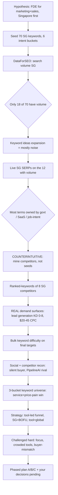

# START HERE — Singapore Experiment: What We Did & Where We Are

**A single-page catch-up so you can reload the whole SG thread in 5 minutes.**
Folder: `agentic-labs/website changes/SG experiment/` · Last updated: 17 August 2026

---

## TL;DR (the macro view in 6 lines)

1. **Hypothesis:** reposition as a *forward-deployed engineering team for marketing & sales*, win *Singapore first* (low volume, high-value, low competition), then go global.
2. **Validated with real data** (DataForSEO + GSC + GA4 + competitor + social recon), total API spend **$0.73**.
3. **Biggest finding:** SG buyers search **the service and the price-pain**, NOT "AI agent." The winnable money lane is **lead generation** (KD 0–8, $20–45 CPC), not the AI terms we assumed.
4. **Behaviour finding:** SG is a **silent-buyer** market — they research your site + LinkedIn before replying. SEO *validates*, it doesn't *discover*.
5. **Strategy evolved** from "3 SG service pages" → "tool-led funnel" (free AI-visibility tool as TOFU, retainers as BOFU, SG for closing).
6. **Next:** you make 3 unblock-decisions (pricing, GBP, proof pilot) + 5 funnel decisions; I build Phase A (one tool + funnel).

---

## The flow of what we did



*(If your editor doesn't render Mermaid, the same sequence is the numbered process log below.)*

---

## Process log — what I actually did, in order

| # | Step | Tool | Output file |
|---|---|---|---|
| 1 | Wrote the hypothesis at first-principles depth | reasoning | `sg-fde-hypothesis.md` |
| 2 | Seeded 70 SG keywords across 6 buckets | — | `keyword-seeds-sg.txt` |
| 3 | Pulled SG search volume for all 70 | DataForSEO Ads | `dataforseo-cache/01_*` |
| 4 | Expanded via keyword ideas (3,666 candidates) | DataForSEO Labs | `dataforseo-cache/02_*` |
| 5 | Ran live SG SERPs on the 12 terms with volume | DataForSEO SERP | `dataforseo-cache/03_*` |
| 6 | Wrote Phase 0 findings (volume thin, SG = positioning market) | reasoning | `phase0-findings.md` |
| 7 | **Mined ranked keywords of 8 SG competitors** (the turning point) | DataForSEO Labs | `dataforseo-cache/04_*`, `05_*` |
| 8 | Long-tail suggestions for our services | DataForSEO Labs | `dataforseo-cache/06_*`, `08_*` |
| 9 | Confirmed winnability with SERPs on low-KD gems | DataForSEO SERP | `dataforseo-cache/07_*` |
| 10 | Bucketed the whole universe by intent | reasoning | `sg-keyword-universe.md`, `09_intent_buckets.csv` |
| 11 | Locked difficulty on final page targets | DataForSEO Labs | `dataforseo-cache/10_bulk_kd.json` |
| 12 | Social + competitor recon (silent buyer, PipelineAI) | web + Chrome | (notes in docs) |
| 13 | Reframed web/SEO cluster as unsafe.design upsell | reasoning | `gap-analysis-bofu.md` (updated) |
| 14 | Synthesized phased roadmap | reasoning | `MASTER-phased-action-plan.md` |
| 15 | Challenged the tool-led funnel idea hard | reasoning | `funnel-strategy-challenged.md` |

Parallel infrastructure done in the main session (not SG-specific but enabling): sitemap bug fixed, 7 GHL pages submitted to Google for indexing, llms.txt/`/mcp`/markdown AEO layer shipped, GSC + GA4 baseline pulled.

---

## Key findings

| Finding | Detail | So what |
|---|---|---|
| Volume is thin | 18/70 seeds had any SG volume; most AI terms = zero | SG is a lead-quality play, not a traffic play |
| Lead-gen is the lane | `singapore lead generation` KD **0**; `lead generation agency` KD 5, **$45 CPC**; `b2b marketing agency singapore` KD 8 | Beachhead = lead generation, not "AI agent" |
| Web/SEO has the big volume | `digital marketing agency` 4,400/$43 CPC; `web design singapore` 3,600; `seo package singapore` KD 0 | Upsell lane via unsafe.design (Phase 1.5) |
| Tech terms are traps | `ai chatbot` 12,100 but KD 46–74, consumer intent | Never lead with technology |
| Google/SaaS own the obvious terms | ai grant/agents/solutions = govt; whatsapp api = Sleekflow | Don't fight them |
| Perplexity already refers us | GA4: 6 ai-assistant sessions | The AEO/llms.txt work is landing |
| SG is already #1 country | GA4 7-day: SG 27 > India 24 > US 23, with zero SG pages | Market is leaning in before we aimed |

---

## Counterintuitive / surprising findings (the ones worth remembering)

1. **Buyers search the outcome and the plain service, never the technology.** I seeded "ai lead generation singapore" (0 volume). The winner was plain "singapore lead generation" (KD 0, 110/mo). Prefixing "ai" *killed* the volume.
2. **Mine competitors, don't brainstorm seeds.** My top-down seed list missed the real terms entirely. Pulling competitors' *ranked keywords* surfaced the money lane. Lesson locked for every future round.
3. **The plain term is far easier than the geo-suffixed one.** `lead generation agency` = KD 5; `lead generation agency singapore` = KD 43. Counter to instinct, the broader term is the easier win.
4. **Low search volume is the thesis, not a problem.** The whole point of SG was low-volume/high-value. The data *confirming* thinness is a green light, not a red one — but only if we treat it as a conversion play, not a traffic play.
5. **The silent buyer flips SEO's job.** In SG, SEO doesn't find the buyer (referral/outbound does) — it *validates* them when they secretly check you. So on-page credibility matters even at tiny search volume.
6. **You accidentally built your own best proof.** The llms.txt/AEO work we did on tryagentikai.com this session IS the service the future AI-visibility tool would sell. Dogfooding became the funnel.

---

## How the thesis evolved (so you see the reasoning, not just the conclusion)

`"3 AI-agent SG pages"` → (volume data) → `"SG is positioning not traffic, 3 deep pages"` → (competitor mining) → `"lead generation is the beachhead, not AI agent"` → (your input) → `"tool-led funnel: free AI-visibility tool = TOFU, retainers = BOFU, SG = closing, global = capture"` → (my challenge) → `"one wedge, prove the loop, then clone — don't rebuild the 3/10 sprawl."`

---

## Folder map (grouped)

```
SG experiment/
├── 00-START-HERE.md                     ← this file (the map)
├── 01-strategy/
│   ├── hypothesis.md                    (the FDE + Singapore hypothesis, first principles)
│   ├── phase0-findings.md               (first validation: volume is thin)
│   ├── gap-analysis.md                  (what SG searches vs what we sell; lead-gen beachhead)
│   ├── funnel-strategy-and-keyword-reference.md  (tool-led funnel, challenged; full keyword bank)
│   └── master-action-plan.md            (Phase 0 to 3 roadmap, owners, gates)
├── 02-keyword-research/
│   ├── keyword-universe.md              (4-bucket keyword map: pain/outcome/service/tech)
│   ├── keyword-seeds-sg.txt             (seed list)
│   └── dataforseo-cache/                (every raw API response + CSVs)
├── 03-architecture/
│   └── website-architecture.md          ← CANONICAL. The lead-journey IA the whole site follows
├── 04-copy/
│   └── home-page-copy.md                (FINAL homepage copy, ready for dev)
└── 05-build/
    └── 00-build-phase.md                ← the live build tracker (start at B0: architecture)
```

**Where to start:** read `03-architecture/website-architecture.md` for the map, then `05-build/00-build-phase.md` for what to build next.


## Next action items (the macro "what now")

**Yours (blocking — nothing moves without these):**
- [ ] SGD pricing bands for lead-gen + landing-page offers
- [ ] Stand up a Google Business Profile (SG) — needed for the local pack
- [ ] Name one SG proof pilot (a real lead-gen result we can document)
- [ ] Answer the 5 funnel decisions in `funnel-strategy-challenged.md` (esp. #1: one-wedge-at-a-time yes/no)

**Mine (ready to start, no input needed):**
- [ ] Draft `/forward-deployed-engineers/` pillar (positioning, no data dependency)
- [ ] On your go: scope the AI-visibility tool to a 2-week build + its landing page + funnel (Phase A)

**Gate before scaling:** the first tool/funnel must book ≥3–5 qualified calls in ~45 days. If it doesn't, fix or kill — do NOT build a second tool on hope. That discipline is what keeps this from becoming the 3/10 sprawl again.
